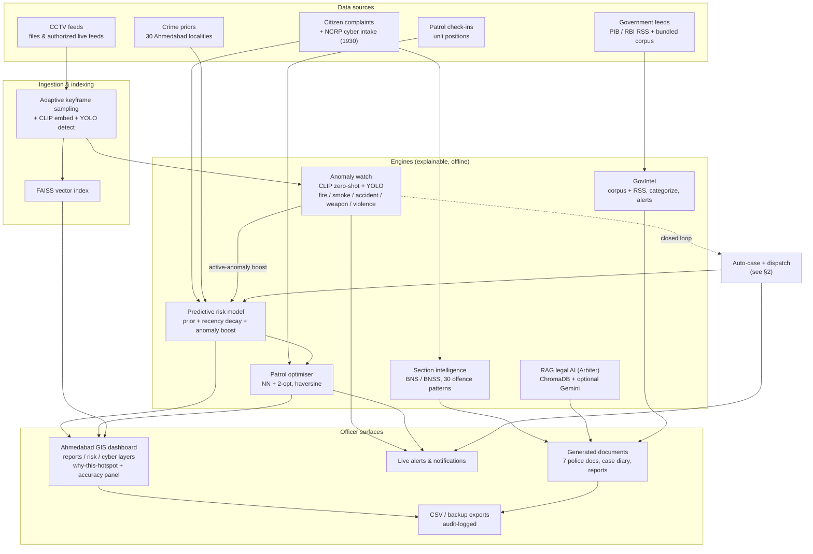
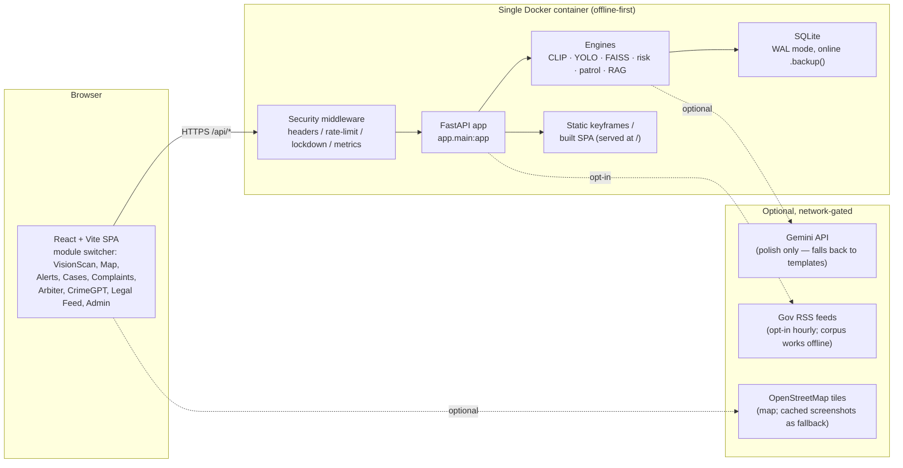
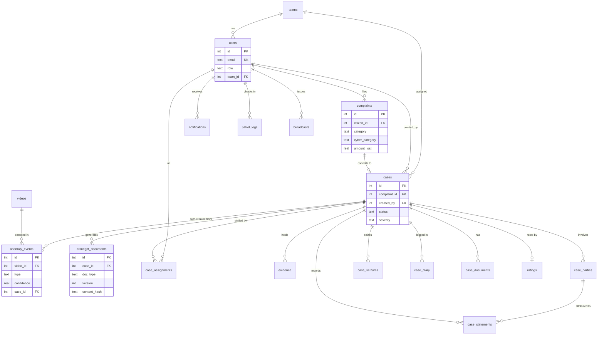

# VisionScan / CityShield — System Architecture

For: **KANAD S.H.I.E.L.D. 2026** · Cyber Crime Branch, Ahmedabad City Police.
Audience: technical evaluators. This document maps every box in the diagrams to a
real file on disk (see the components table at the end) so nothing here is a
marketing abstraction — it is the code that ships.

One sentence: **citizen complaints, CCTV feeds, crime priors, and government
feeds flow into a set of explainable engines (CLIP/YOLO anomaly, recency-weighted
risk, patrol optimiser, BNS/BNSS section intelligence, RAG legal AI) whose output
lands on four officer surfaces — a GIS dashboard, live alerts, generated
documents, and exports — and a single live anomaly closes the loop back into a
case + dispatch automatically.**

Everything runs **offline-first** on FastAPI + SQLite + a React/Vite build;
Gemini is an optional polish layer, never a dependency.

---

## 1. Top-level data flow



**How to read it:** a complaint feeds both the risk model and section
intelligence; a CCTV keyframe is embedded once (CLIP) and reused by both search
(FAISS) and anomaly scoring (no second inference); the anomaly score boosts the
risk surface *and* can spawn a case; the risk model orders the patrol optimiser's
stops. Priors keep the map sensible on day zero before live data accumulates.

---

## 2. Closed-loop incident response

A single live detection lights up four modules. This is the sequence the
`incident_loop` module runs, fail-soft, for a **new** event on a **live** feed
(`backend/app/services/incident_loop.py`).

```mermaid
sequenceDiagram
    autonumber
    participant Cam as Live CCTV feed
    participant Pipe as Keyframe pipeline<br/>(CLIP + YOLO)
    participant Anom as Anomaly watch
    participant Loop as Incident loop
    participant DB as SQLite (cases / evidence)
    participant Risk as Risk model
    participant Patrol as Patrol (nearest unit)
    participant Off as Officer

    Cam->>Pipe: frame stream
    Pipe->>Anom: CLIP vector + YOLO detections
    Anom->>Anom: score vs prompt bank,<br/>margin over "normal" + debounce
    Anom->>Loop: NEW event (type, confidence, area, keyframe)
    Loop->>Loop: map type -> severity / priority
    Loop->>DB: INSERT case (origin: VisionScan AI)
    Loop->>DB: attach keyframe as evidence
    Loop->>DB: backfill case_id on event (dedupe anchor)
    Loop->>Risk: +1 active anomaly on the camera's locality
    Risk-->>Risk: area risk surface bumps
    Loop->>Patrol: nearest_unit_to_area(area)
    Patrol-->>Loop: nearest checked-in unit + distance
    Loop->>Off: high-priority DISPATCH notification (links to case)
    Loop->>DB: auto-assign officer to the case
```

**Honest scope note:** the loop is env-gated (`VISIONSCAN_AUTO_CASE`, default ON),
only fires for a genuinely new event on a geo-tagged live feed, dedupes within the
debounce window so one incident never spawns two cases, and is wrapped so any
failure is logged and swallowed — it can **never** break CCTV ingestion.

---

## 3. Deployment view



**Deployment facts (verified):**
- One image, served at `http://localhost:8080` via `docker compose up -d`
  (`docker-compose.yml`, `Dockerfile`) or `start.ps1`. The SPA build is copied
  into `backend/app/static` and mounted at `/`; otherwise the frontend runs on
  Vite `:5173` in dev.
- **Offline-first:** models and data stay on the box. `assert_secure()` at
  startup refuses prod auth mode on the dev JWT secret. Gemini, gov RSS polling,
  and OSM tiles are the only outward calls — all optional and degrade gracefully.
- **CPU-first:** runs on a standard laptop; a GPU only makes ingestion faster.
- On Windows dev, `KMP_DUPLICATE_LIB_OK=TRUE` is set before torch/faiss import
  (OpenMP duplicate workaround; not needed in the Linux Docker build).

---

## 4. Components → files

Every box above traces to a real path. Verified present on disk
(`backend/app/...` unless noted).

| Component / box | File(s) | Role |
|---|---|---|
| App entrypoint, router wiring, model warmup | `main.py` | Mounts every router under `/api/*`; serves SPA at `/`. |
| Config, device, secure-mode gate | `config.py` | `assert_secure()`, dirs, Gemini key. |
| SQLite access, schema init | `database.py` | `get_conn()`, `init_db()`, WAL. |
| **CCTV pipeline** (sampling + embed + detect) | `services/pipeline.py`, `core/ingestion.py`, `core/preprocessing.py` | Keyframe extraction and per-frame analysis. |
| **CLIP embedding** | `core/embedding.py` | One vector per keyframe; reused by search + anomaly. |
| **YOLO detection** | `core/detection.py` | Object labels (incl. COCO weapon classes). |
| **FAISS index** + semantic search | `core/index.py`, `core/query_router.py`, `api/routes.py` | Vector search, text/object/face query routing. |
| **Anomaly watch** (CLIP zero-shot + YOLO) | `core/anomaly.py`, `services/anomaly_events.py`, `api/anomaly_routes.py` | 5 classes; margin calibration + debounce. |
| **Closed-loop incident response** | `services/incident_loop.py` | Anomaly → case → risk → dispatch. |
| **Predictive risk model** | `platform/predictive.py` | `compute_risk()`; glass-box `contributions`; `/api/predict/risk`. |
| **Backtest harness** | `platform/validation.py` | Rolling-origin CV; HR@k / PAI@k / CI / oracle; `/api/predict/validation`. |
| Backtest CLI | `scripts/predictive_backtest.py` | Throwaway-DB headline + baseline table. |
| **Patrol optimiser** (NN + 2-opt) | `platform/patrol.py` | Route order + `nearest_unit_to_area()` dispatch. |
| Ahmedabad GIS constants | `constants/ahmedabad.py` | 30 localities + city centre. |
| Locality crime priors | `platform/seed_ahmedabad.py` | `AREA_CRIME_PROFILE` intensities. |
| Synthetic complaint stream + planted surges | `platform/seed_synthetic.py` | Deterministic backtest data. |
| **CityShield platform** (auth, users/teams, cases, complaints, notifications) | `platform/routes.py`, `platform/service.py`, `platform/models.py`, `platform/security.py` | RBAC, case access, audit, notify. |
| NCRP cyber intake taxonomy | `constants/cyber.py` | Golden-hour / 1930 fraud channels. |
| Analytics | `platform/analytics.py` | Dashboard + cyber map data. |
| **Section intelligence** (BNS/BNSS) | `crimegpt/legal_sections.py` | `OFFENCE_MAP` (30 patterns). |
| **CrimeGPT** docs + case diary | `crimegpt/service.py`, `crimegpt/templates.py`, `crimegpt/routes.py` | 7 statutory documents, en/hi/gu. |
| **GovIntel** legal feed | `govintel/sources.py`, `govintel/service.py`, `govintel/categorize.py`, `govintel/routes.py` | Corpus + PIB/RBI RSS, alerts, cross-links. |
| **Arbiter** RAG legal AI | `arbiter/service.py`, `arbiter/store.py`, `arbiter/llm.py`, `arbiter/guards.py` | ChromaDB RAG + optional Gemini + prompt-injection guards. |
| Forensic report / brand helpers | `services/report.py` | Navy/gold PDF report builder. |
| **Exports** (backup + CSV, audit-logged) | `api/export_routes.py` | WAL-safe `.backup()`, CSV dumps. |
| **Security middleware** | `security_mw.py` | Headers, rate-limit, lockdown, metrics. |
| Admin ops (monitoring + lockdown) | `api/admin_system.py` | Server status + emergency lockdown. |
| SSRF / net guard | `net_guard.py` | Outbound request guard. |
| Upload validation | `upload_validation.py` | File-type / size guard on ingest. |
| **Frontend SPA** + module switcher | `frontend/src/App.jsx`, `frontend/src/api.js` | Tabs: VisionScan, City Map, Live Alerts, Cases, Complaints, Arbiter, CrimeGPT, Legal Feed, Admin. |
| GIS map (react-leaflet) | `frontend/src/components/platform/CityMapView.jsx` | Reports / Risk forecast / Cyber-fraud layers, why-this-hotspot, accuracy panel, CSV exports, OSM tiles. |
| Cyber intake form (golden-hour 1930) | `frontend/src/components/platform/ComplaintsView.jsx` | NCRP fields + 1930 banner. |
| Live alerts | `frontend/src/components/platform/LiveAlertsView.jsx` | Always-on anomaly feed. |

---

## 4.5 Data model — entity-relationship diagram

One SQLite database backs the whole platform; every module's tables hang off the
shared `users` / `cases` spine, which is what makes the closed loop (a CCTV
anomaly auto-creating a case) and the CrimeGPT unified case-data pool possible.
Key entities and their relationships (`PK` primary key, `FK` foreign key, `UK` unique):



Schema source of truth: `backend/app/platform/schema.py` (identity, cases,
complaints, anomaly_events, broadcasts, audit, patrol), `backend/app/crimegpt/schema.py`
(the case-data pool), `backend/app/database.py` (VisionScan core: videos, frames,
detections, faces), and `backend/app/govintel/schema.py` (legal-feed corpus).

---

## 5. Cross-references

- Demo runbook & failure recovery: [`DEMO_DAY.md`](DEMO_DAY.md),
  [`DEMO_FALLBACK.md`](DEMO_FALLBACK.md).
- Measured accuracy headline + criteria checklist: [`JUDGE_ONEPAGER.md`](JUDGE_ONEPAGER.md).
- Data provenance & honest-numbers disclaimer: [`AHMEDABAD_CRIME_DATA.md`](AHMEDABAD_CRIME_DATA.md).
- Security posture: [`SECURITY_TESTING_REPORT.md`](SECURITY_TESTING_REPORT.md).
- Screenshot capture list: [`SCREENSHOTS_NEEDED.md`](SCREENSHOTS_NEEDED.md).
