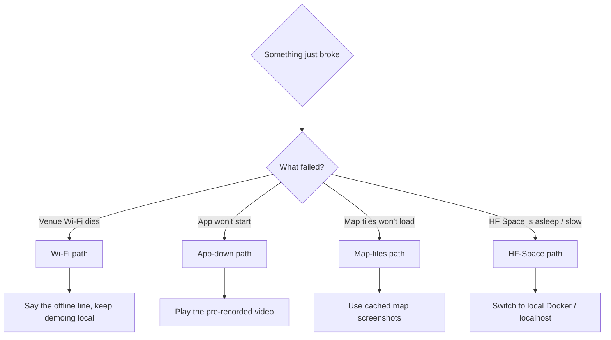

# VisionScan — Demo-Day Fallback Plan

When something breaks on stage, **stay calm and lean into the offline story** —
for this product a Wi-Fi failure is not a bug, it is the pitch. This is the
decision tree the presenter follows. Pair it with the runbook in
[`DEMO_DAY.md`](DEMO_DAY.md) (§6 "Failure-recovery" there is the 10-second
version; this file is the full tree with exact commands).

---

## Decision tree



---

## 1. Venue Wi-Fi dies  →  *this is a feature, not a failure*

**Say this (turn it into a selling point):**
> "Perfect — let me show you why that doesn't matter. VisionScan is **offline-first
> by design**. Models and footage stay on this laptop; nothing needs the internet.
> This is exactly the air-gapped crime-scene scenario we built for."

**Then:** keep demoing on `http://localhost:8080`. Everything core works offline —
CCTV search, anomaly watch, the closed loop, the risk map (cached/last tiles),
cases, complaints, CrimeGPT documents (template fallback), and exports.

**If the app wasn't already up**, start it locally:
```powershell
# Option A — Docker (one command, matches production)
docker compose up -d         # then open http://localhost:8080

# Option B — no Docker, run the two processes directly
# Backend (from backend/):
.\.venv\Scripts\activate
uvicorn app.main:app --reload --port 8000
# Frontend (from frontend/, second terminal):
npm run dev                  # http://localhost:5173 (proxies /api to :8000)
```
Only **Gemini polish, gov-RSS refresh, and live map tiles** need network — all
optional, all degrade gracefully (see [`ARCHITECTURE.md`](ARCHITECTURE.md) §3).

---

## 2. App won't start / crashes mid-demo  →  pre-recorded video

**Say this:**
> "I'll switch to a recording I captured this morning so I don't waste your time —
> then I'll happily take it live in Q&A once it's back."

**Pointer:** play `docs/assets/demo-full.mp4` (capture it in advance — see the
SCREENSHOTS checklist for the GIF/video specs). Keep it on the **desktop** and on a
**USB stick** so it plays with zero network.

**Recommended capture commands (record these the night before):**
```powershell
# OBS Studio: Sources -> Display/Window Capture of the browser at :8080,
# record at 1080p30; do the full 6-min runbook once, end-to-end.

# Or ffmpeg screen capture on Windows (whole desktop, 30 fps):
ffmpeg -f gdigrab -framerate 30 -i desktop -c:v libx264 -pix_fmt yuv420p `
  -preset veryfast docs/assets/demo-full.mp4

# Trim/compress an oversized recording to a safe size:
ffmpeg -i docs/assets/demo-full.mp4 -vf "scale=1280:-2" -c:v libx264 `
  -crf 26 -preset slow -an docs/assets/demo-full-small.mp4
```

**Recover the app in the background while the video plays:**
```powershell
docker compose down; docker compose up -d --build   # or .\start.ps1 -Rebuild
docker compose logs -f backend                      # watch it come healthy
```

---

## 3. Map tiles won't load  →  offline chip + cached screenshots

The GIS map fetches **OpenStreetMap tiles** over the network
(`CityMapView.jsx`); the rest of the map — risk circles, the why-this-hotspot
breakdown, the accuracy panel, CSV exports — is computed locally and renders fine
on a grey/blank basemap.

**Say this:**
> "The basemap tiles come from OpenStreetMap and need the net — but notice **all the
> intelligence is local**: the risk scores, the hotspot explanation, the accuracy
> panel. In a real deployment we ship a cached/offline tile pack; the model never
> depends on the internet."

**Fallback:** open the **cached map screenshots** from `docs/assets/`
(`map-risk-layer.png`, `map-why-hotspot.png`, `map-accuracy-panel.png`) so the
audience still sees the full map experience. Capture these in advance (see
SCREENSHOTS checklist) precisely so you are not relying on live tiles on stage.

---

## 4. HF Space is asleep / too slow  →  local Docker

Hugging Face Spaces cold-start and throttle; **never make it the primary demo.**

**Say this:**
> "The hosted link is just a convenience for you to try later — the real product
> runs right here on the laptop."

**Fallback:** demo on local Docker at `http://localhost:8080` (already your
primary). If the Space is needed for the "scan the QR" handoff and it's cold,
open it on your phone a few minutes early so it has warmed by Q&A.

---

## Pre-stage so none of this happens (do the night before)
- [ ] `docker compose up -d` run; models downloaded & cached; one search done to warm CLIP/YOLO.
- [ ] **Pre-recorded full demo** saved to `docs/assets/demo-full.mp4` **and** a USB stick.
- [ ] **Cached map screenshots** in `docs/assets/` (risk layer, why-hotspot, accuracy panel).
- [ ] A **sample forensic PDF** already exported and on the desktop.
- [ ] HF Space opened once on a phone so it's warm; QR code printed.
- [ ] Laptop charged + charger; **do not depend on venue Wi-Fi** — that's the whole point.
- [ ] Backtest headline re-run once (`python scripts/predictive_backtest.py`) so the numbers you quote are today's.

See [`DEMO_DAY.md`](DEMO_DAY.md) for the full runbook, Q&A drills, and slide outline.
